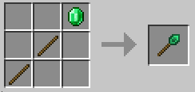
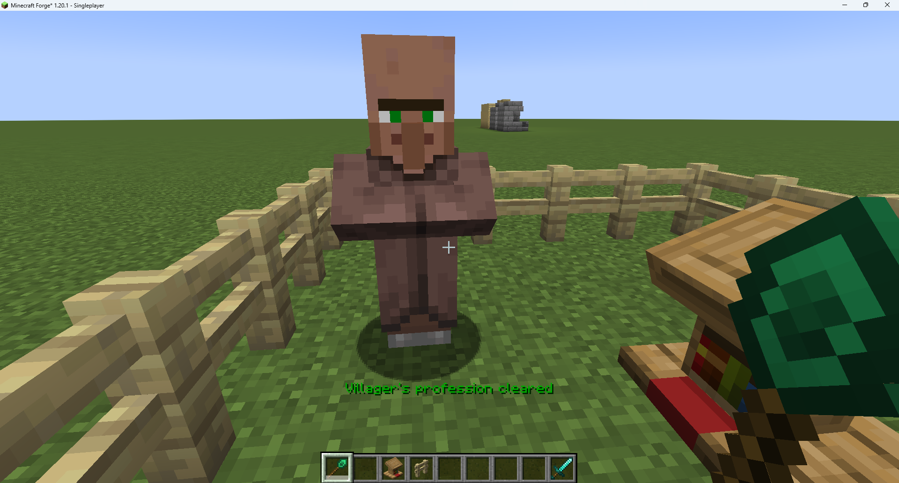
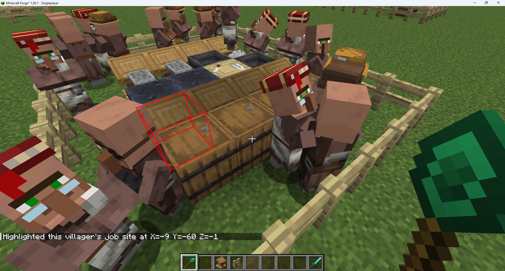
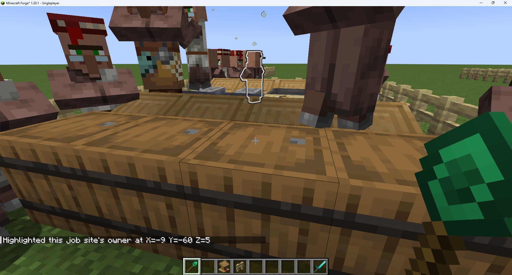
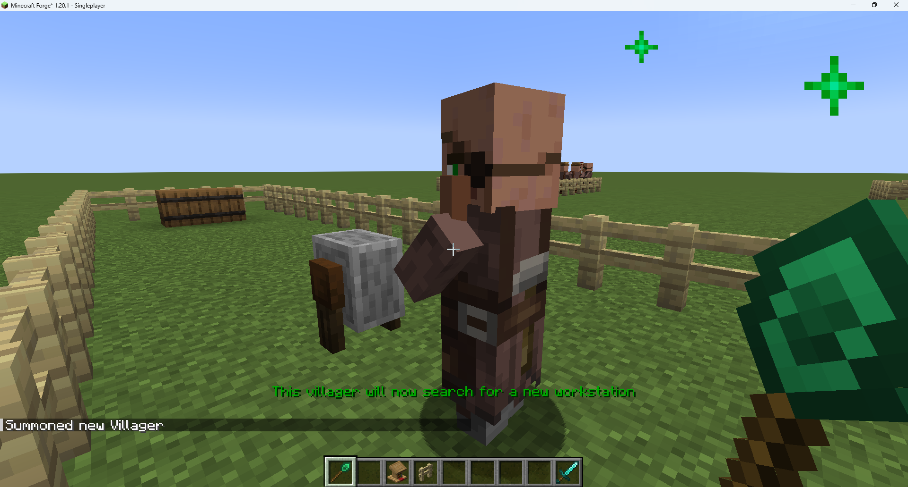
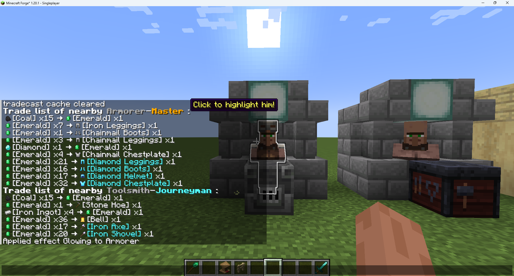
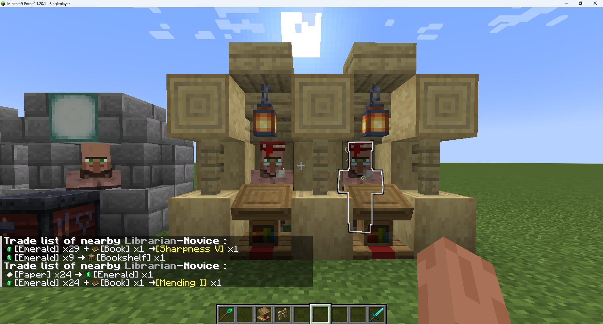

# Trade Tweaks

A Minecraft Forge mod that provides versatile utility staffs and in-game options to enhance the player experience when trading with villagers.

> Currently in early preview - many features are still under development.


## Key Features

### Emerald Wand



**Usage:**

- Sneak + Mouse Wheel: Cycle through modes
- Sneak + Right Click: Activate current mode

| Mode              | Target                | Effect                        |
| :---------------- | :-------------------- | :---------------------------- |
| Profession Clear  | Any employed villager | Resets villager to unemployed |
| Workblock Tracker | Any employed villager | Highlights linked workblock   |
| Villager Tracker  | Workstation blocks    | Highlights villager using it  |
| AI Refresh        | Unemployed villagers  | Forces job search behavior    |

**1. Profession Clear**




- Removes profession from any villager
- Works even on leveled/traded villagers
- Resets their trade progression completely


**2. Workblock(JobSite) Tracker**



- Visually highlights the villager's linked workstation
- Effective range: 64 blocks


**3. Villager Tracker**



- Applies glowing effect to villager using the targeted workstation


**4. Villager AI Refresh**



- Forces unemployed villagers to stop current activities
- Makes them (try to) immediately search for nearest valid workstation


## Trade Broadcast System

Displays nearby villagers' trade lists (with item icons) in chat, with click-to-highlight functionality. Won't repeat broadcasts for unchanged trades.






#### Commands


```
/tradecast mode [option]
```

(Client-side) Filters which villagers get broadcast:

| Option      | Effect                    |
| :---------- | :------------------------ |
| `all`       | All villagers             |
| `librarian` | Only librarians           |
| `off`       | Disables broadcast system |


```
/tradecast radius [blocks]
```

(Server-side) Sets broadcast range (1-32 blocks). Requires permissions.


```
/tradecast refresh
```

(Client-side) Clears cached villager/trade data.


```
/tradecast render [bool]
```

(Client-side) Toggles item icon rendering (if true, text-only mode will be available for compatibility).


```
/tradecast time [seconds]
```

(Server-side) Adjusts trade check interval. Requires permissions.


### ...


## Compatibility

- Should work with all mod-added villager professions
- Potential rendering conflicts when used with Showcase Item/Quark's inventory icon features (disable client rendering if overlap occurs)
- 


## Credits and Licensing

This mod incorporates resources from the following third-party projects, and we gratefully acknowledge their contributions:

### Code Attribution

The item rendering functionality in this mod is derived from **[ShowcaseItem]**, which is licensed under the Creative Commons Attribution-NonCommercial-ShareAlike 3.0 Unported (CC BY-NC-SA 3.0) license.

- Original source: [starforcraft/Showcase-Item: Allows you to showcase your item in the chat](https://github.com/starforcraft/Showcase-Item)
- Modifications: Enhanced the ChatComponentMixin and ItemRenderer implementations.

### Assets Attribution

The texture `textures/emerald_wand.png` is a modified version of an asset from **[ConstructionWand]**, licensed under the MIT License.

- Original asset: [Theta-Dev/ConstructionWand: Minecraft Mod - Construction Wands make building easier!](https://github.com/Theta-Dev/ConstructionWand)
- Changes: Recolored.

