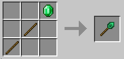
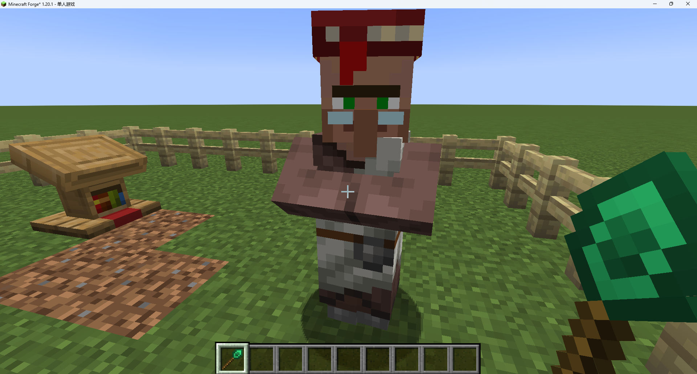
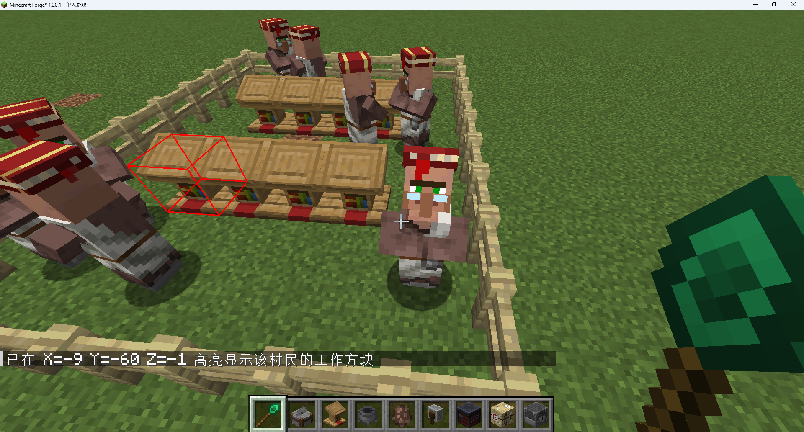
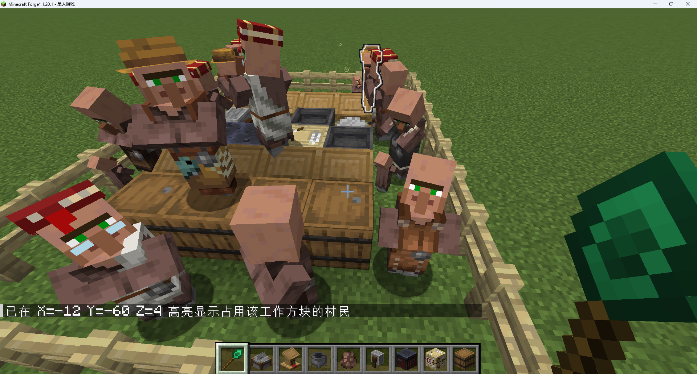
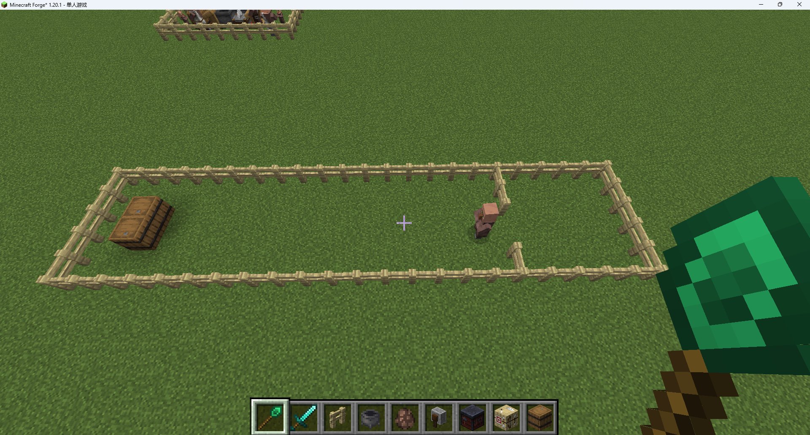
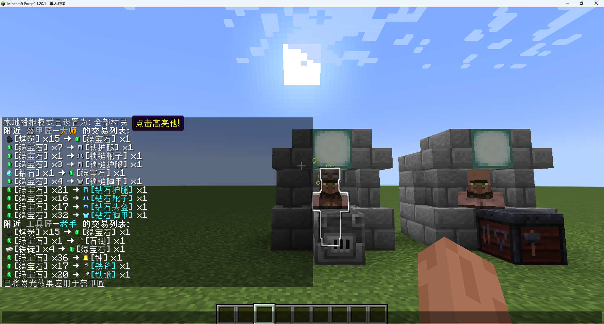

# 中文版更新可能不及时，请查看英文版或publish内更新日志

# Trade Tweaks

Minecraft mod, Forge

提供功能多样实用的工具手杖以及游戏内选项，提升玩家与村民交易时的游戏体验


> 目前为早期预览版本，诸多功能有待实现


## 主要内容

### 绿宝石手杖




**使用：**

+ 潜行状态下使用鼠标滚轮切换不同模式
+ 潜行状态下右键使用：

| 模式         | 应用对象                       | 效果                   |
| ------------ | ------------------------------ | ---------------------- |
| 职业清除     | 任意职业的村民                 | 使村民重置为无业       |
| 工作方块追踪 | 任意职业的村民                 | 高亮该村民的工作方块   |
| 村民追踪     | 任意职业的村民所对应的工作方块 | 高亮占有该方块的村民   |
| 村民行为刷新 | 无业村民                       | 令村民重新寻找工作方块 |

**1.职业清除**



+ 清除任意村民的职业
+ 可以清除已经交易过甚至已经升级过的村民的职业，并重置他们的交易等级


**2.工作方块追踪**



+ 高亮透视显示村民当前的工作方块
+ 有效检测范围为64格


**3.村民追踪**



+ 若有村民正在使用该方块作为工作方块，则给予该村民发光效果


**4.村民行为刷新**



+ 使无业村民停止当前的大部分活动，尝试重新寻找最近的工作方块


### 交易播报

允许将附近村民的交易列表（以及物品图标）播报到玩家的聊天栏，并可以点击高亮对应村民。同一村民如果交易未发生变化则不会重复播报。




#### 命令


```
/tradecast mode [option]
```

客户端命令，选择播报的村民类型

| option      | 效果                 |
| ----------- | -------------------- |
| `all`       | 播报所有村民         |
| `librarian` | 仅播报图书管理员     |
| `off`       | **关闭交易播报系统** |


```
/tradecast radius [blocks]
```

修改服务器播报范围（1-32格），需要权限


```
/tradecast refresh
```

客户端命令，清空已记录的村民及其交易列表信息


```
/tradecast render [bool]
```

客户端命令，开启或关闭物品图标渲染；关闭后，将仅输出文字内容

+ 这是出于mod兼容性的考虑，如果出现渲染错误、偏移等问题，请关闭


```
/tradecast time [seconds]
```

修改服务器更新检测间隔，需要权限


### ...


## 兼容性

+ 理论上兼容所有由mod添加的村民职业
+ 与Showcase Item，Quark一起安装，且各mod均开启了物品图标渲染到物品栏功能时，可能会有出现渲染问题（图标偏移或重合），可关闭客户端渲染
+ 


## 声明与致谢

本模组使用了以下第三方项目的资源，在此声明版权归属并致以感谢：

### 代码引用

聊天栏渲染物品的代码基于 **[ShowcaseItem]** 项目实现，原项目采用 CC BY-NC-SA 3.0 协议授权：

- 原始项目：[starforcraft/Showcase-Item: Allows you to showcase your item in the chat](https://github.com/starforcraft/Showcase-Item)
- 修改内容：使用MixinExtra优化了部分Mixin, 改进部分物品渲染逻辑

### 素材引用

纹理文件 `textures/emerald_wand.png` 修改自 **[ConstructionWand]** 的素材，原素材采用 MIT 授权：

- 原始素材：[Theta-Dev/ConstructionWand: Minecraft Mod - Construction Wands make building easier!](https://github.com/Theta-Dev/ConstructionWand)
- 修改内容：色相调整